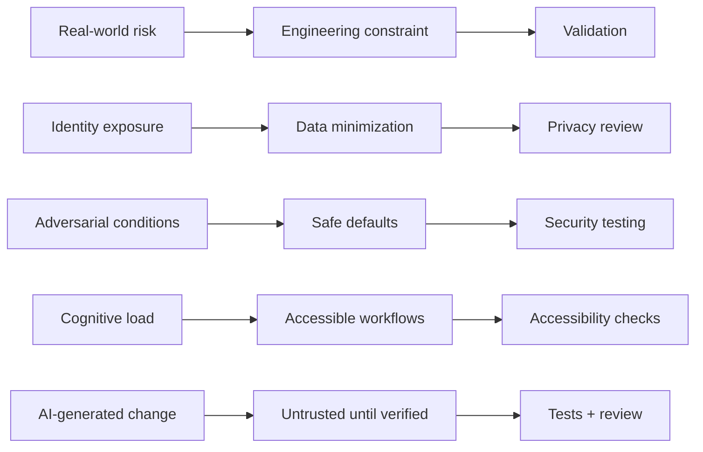

# Secure Pride

**Security infrastructure for people who cannot fail safely.**

Secure Pride builds privacy-first cybersecurity tooling, operational frameworks, and accessible systems for LGBTQ+ communities and other people operating under elevated exposure, surveillance, or institutional risk.

We design for the conditions security documentation usually abstracts away: legal risk, identity exposure, cognitive load, limited staffing, and the cost of getting a security decision wrong.

## What is live

The repository currently provides:

- **Privacy-first security infrastructure** — no analytics, tracking, or behavioral telemetry by design.
- **AI-assisted development controls** — generated code and recommendations are treated as untrusted input until validated.
- **Accessibility-first engineering standards** — security controls are expected to remain usable under cognitive load and imperfect conditions.
- **Production-oriented deployment surfaces** — Astro application infrastructure, Cloudflare Pages deployment, and a self-contained Docker image for the static build.
- **Security and operational documentation** — contributor standards, implementation quick reference, AI-development guidance, release/token-rotation procedures, and recorded architectural decisions.

This is the shipped surface. Longer-horizon work remains in the [roadmap](#roadmap).

## Why Secure Pride exists

Security systems often assume neutrality. The environments we build for are not neutral.

For many communities:

- Exposure can create legal or employment risk.
- Data leakage can create direct personal harm.
- Surveillance can become a mechanism of institutional or social targeting.
- A security control that requires ideal staffing, attention, or technical conditions may fail precisely when it matters most.

Secure Pride treats those constraints as part of the threat model rather than edge cases.

> Security is not optional—and it must not come at the cost of dignity.

## Security posture

| Invariant | Engineering consequence |
| --- | --- |
| **Privacy is a baseline** | No analytics, tracking, or behavioral telemetry; minimize sensitive data at design time. |
| **Threats are adversarial** | Model legal, social, institutional, and technical exposure; prefer safe defaults over convenience. |
| **Accessibility is a security property** | Design for cognitive load, imperfect conditions, and users who cannot rely on ideal workflows. |
| **AI is not an authority** | Treat AI output as untrusted input; verify generated code and security claims before use. |
| **Production readiness matters** | No placeholders masquerading as finished work; validate code, security, accessibility, and documentation before release. |

### Risk → constraint → validation


```mermaid
flowchart LR
    R[Real-world risk] --> C[Engineering constraint]
    C --> V[Validation]

    R1[Identity exposure] --> C1[Data minimization]
    C1 --> V1[Privacy review]

    R2[Adversarial conditions] --> C2[Safe defaults]
    C2 --> V2[Security testing]

    R3[Cognitive load] --> C3[Accessible workflows]
    C3 --> V3[Accessibility checks]

    R4[AI-generated change] --> C4[Untrusted until verified]
    C4 --> V4[Tests + review]
```

The governing idea is simple: a stated risk must produce a concrete engineering constraint, and that constraint must have a way to be checked.

## Non-negotiables

All contributions must:

- Include zero telemetry or hidden data collection.
- Protect sensitive identity data, including sexual orientation and gender identity (SOGI) information.
- Meet the project's accessibility baseline.
- Pass applicable tests, linting, and security checks.
- Include documentation appropriate to the change.

Detailed contribution and AI-development requirements live in [CONTRIBUTING.md](CONTRIBUTING.md), [Copilot Instructions](docs/COPILOT-INSTRUCTIONS.md), and the [Quick Reference](docs/QUICK-REFERENCE.md).

## Development

Built with [Astro](https://astro.build) and deployed to Cloudflare Pages.

```bash
npm install
npm run dev      # Astro dev server
npm run build    # Static build → dist/
npm run check    # Astro build + TypeScript validation
```

For containerized local use:

```bash
docker build -t secure-pride .
docker run -p 8080:80 secure-pride
```

The Docker image serves the static Astro build. Cloudflare Pages Functions such as `/api/scan` and `/api/health` run on the Cloudflare runtime and are not included in the image. For full-stack local development, use `npx wrangler pages dev`.

Release and token-rotation procedures are documented in [docs/DOCKERHUB_TOKEN_WORKFLOW.md](docs/DOCKERHUB_TOKEN_WORKFLOW.md).

## Contributing

Secure Pride welcomes contributors aligned with the mission and willing to work within its security and accessibility constraints.

Start with [CONTRIBUTING.md](CONTRIBUTING.md). Implementation-specific guidance is kept in the documentation layer rather than duplicated here.

## Security policy

If you discover a vulnerability, do not open a public issue. Contact **security@securepride.org** with reproduction details and allow time for responsible disclosure.

## Contact

- Website: https://securepride.org
- General: hello@securepride.org
- Security: security@securepride.org

## Project structure

The repository is organized around the application, security/development guidance, and operational automation. See the repository tree and linked documentation for the current structure; historical material is retained under `docs/history/` where applicable.

## Roadmap

The roadmap is intentionally separate from the shipped surface above.

- [ ] Secure container templates (reproducible + auditable)
- [ ] Privacy-first deployment pipelines
- [ ] Accessibility validation tooling
- [ ] Community security playbooks
- [ ] Restore the deferred Astro blog system and rebuild its components against the current design system

## License

Apache License 2.0. See [LICENSE](LICENSE).
